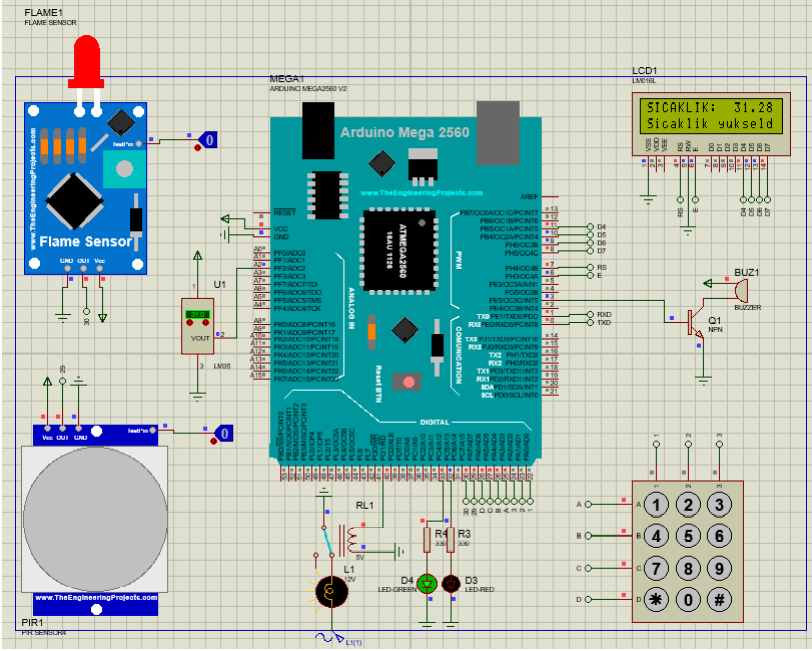

# Smart-home-simulation-arduino
Bu arduino projesi yangın alarmı, hareket algılayan ışık sistemi, dijital termometre, kilit sistemi arduino kodlarını içermektedir. 
Proteus devre tasarımı ProteusProje klasöründe yer almaktadır. 
Arduino kodu ProjeKodu.ino da yer almaktadır. 
 
This arduino project includes fire alarm, motion detecting light system, digital thermometer, lock system arduino codes. 
The Proteus circuit design is located in the ProteusProject folder. 
Arduino code is available in ProjeKodu.ino. 

